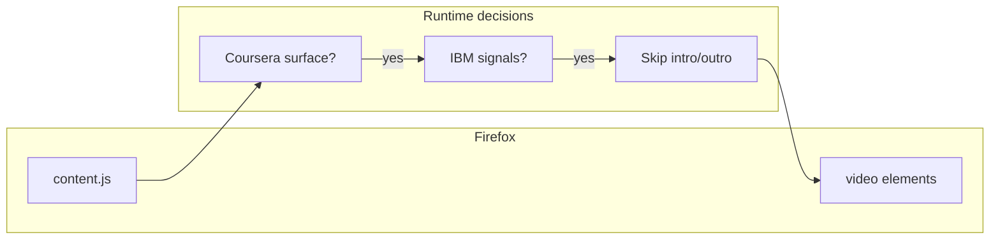

# IBM Video Skipper (Coursera)

<p align="center">
  
</p>

<p align="center">
  <strong>Firefox WebExtension · Manifest V3 · Content Scripts</strong><br />
  <em>Automated temporal excision of IBM-branded lecture bumpers on Coursera.</em>
</p>

<p align="center">
  <a href="https://github.com/sidnei-almeida/ibm-video-skipper-coursera"><strong>github.com/sidnei-almeida/ibm-video-skipper-coursera</strong></a>
</p>

<p align="center">
  Maintainer: <a href="https://github.com/sidnei-almeida">@sidnei-almeida</a>
</p>

---

## Executive summary

**IBM Video Skipper** is a narrowly scoped browser extension that advances HTML5 video playback past the standardized **intro** and **outro** segments commonly present in IBM-offered courses on Coursera. By trimming approximately **6.5 seconds** at the beginning and **5 seconds** at the end of each eligible playback, the extension reduces repetitive audiovisual overhead and improves session continuity for learners.

---

## Problem statement *(with empirical rigor and mild emotional damage)*

IBM Skills Network productions on Coursera frequently prepend and append short branded segments. These segments are not merely visual: they carry a **distinct low-frequency motif**—politely described here as “the bass incident”—that reproduces with uncomfortable fidelity across consumer audio equipment.

**Operational research finding:** when studying **after civil twilight**, learners often reduce playback volume to maintain domestic tranquility. Unfortunately, **bass energy** does not always respect roommate sleep schedules, door frames, or the Geneva Conventions of shared housing. The result is a recurring conflict between *course completion KPIs* and *interpersonal harmony KPIs*.

This extension does not judge the creative direction of corporate bumper audio. It simply **removes the temporal window** in which that creative direction is most likely to occur—without altering Coursera’s platform behavior elsewhere.

---

## Scope & guarantees

| Dimension | Detail |
|-----------|--------|
| **Browser** | Mozilla Firefox (Gecko), minimum version **109** |
| **Manifest** | **Manifest V3** (`manifest_version: 3`) |
| **Host permissions** | Implicit via `content_scripts` match patterns only (`*://*.coursera.org/*`, `*://coursera.org/*`) |
| **Network access** | None declared; extension does not fetch remote resources for its core logic |
| **Data collection** | None; no analytics, telemetry, or external endpoints |

---

## Functional specification

### Playback adjustment

- **Intro skip:** on play and during early playback, if the current time is within the configured intro window from the start, seek past it.
- **Outro skip:** before the configured outro window at end-of-media, seek to end (or clamp) so the bumper does not play at full volume through sleeping humans.

Constants are defined in `content.js` (`INTRO_SEC`, `OUTRO_SEC`) and can be adjusted for future bumper-length changes.

### IBM course detection (multi-signal)

Many IBM courses **do not** include `ibm` in the URL slug. The extension therefore uses a **layered classifier** that combines:

1. **URL & query string** — presence of `ibm` in path, hash, or parameters.
2. **Course slug** — substring match on `ibm` when derivable from `/learn/...` or legacy `/lecture/...` paths.
3. **Document metadata** — Coursera often exposes **“Offered by IBM”** in `meta` description / Open Graph / Twitter tags even when the slug is neutral.
4. **JSON-LD** — structured data may declare `provider.name === "IBM"`; the script parses `application/ld+json` blocks with a conservative fallback pattern.
5. **DOM heuristics** — partner links (e.g. IBM Skills Network, Coursera partner paths).
6. **Title heuristic** — `document.title` containing “IBM”.

**Coursera surface gating:** scripts activate only on recognized learning paths (e.g. `/learn/...`, embedded `/learn/` segments, legacy `/lecture/...`, professional certificate roots as configured).

### Dynamic pages (SPA)

Coursera behaves as a single-page application. The content script:

- Observes DOM mutations for late-mounted `<video>` elements.
- Patches `history.pushState` / `replaceState` to re-scan after client-side navigation.

---

## Architecture (high level)



---

## Repository layout

| Path | Role |
|------|------|
| `manifest.json` | Extension identity, Gecko `browser_specific_settings`, content script registration |
| `content.js` | Detection pipeline, video listeners, SPA hooks |
| `icons/` | Toolbar and package icons (`icon-16.png` … `icon-128.png`), optional AMO-style promo tile `promo-440x280.png` |
| `logos/` | Source artwork (optional; not required at runtime) |

---

## Installation (development)

1. Clone the repository:
   ```bash
   git clone https://github.com/sidnei-almeida/ibm-video-skipper-coursera.git
   cd ibm-video-skipper-coursera
   ```
2. Open Firefox → **about:debugging** → **This Firefox** → **Load Temporary Add-on…**
3. Select `manifest.json` from the project root.

For repeatable builds and signing workflows, see Mozilla’s [Extension Workshop](https://extensionworkshop.com/) documentation.

---

## Configuration

Advanced users may edit **constants** at the top of `content.js`:

- `INTRO_SEC` — duration treated as intro (seconds).
- `OUTRO_SEC` — duration treated as outro (seconds).

No `storage` API or options page is required for the default behavior.

---

## Known limitations

- **Cross-origin iframes:** if the lecture video is embedded in a frame whose origin does not carry the same document metadata or scripts, IBM detection may not run in that frame’s context. This is a structural constraint of browser security boundaries.
- **Non-IBM Coursera courses:** skipping is intentionally disabled when IBM signals are absent.
- **Bumper timing drift:** if IBM changes bumper lengths globally, update `INTRO_SEC` / `OUTRO_SEC`.

---

## Privacy & security posture

- No background service worker with persistent network activity for this feature set.
- No cookies, credentials, or personal data are read beyond what any script running on a Coursera page can already access in that tab.
- Review `manifest.json` and `content.js` for the authoritative behavior.

---

## Roadmap *(non-binding)*

- Optional **options UI** with persisted skip windows (`browser.storage.sync`).
- User-toggle for intro vs outro independently.

---

## Trademark note

*Coursera* and *IBM* are trademarks of their respective owners. This project is an independent tool and is not affiliated with or endorsed by Coursera or IBM.

---

## License

No license file is present in this repository yet. Add a `LICENSE` of your choice before redistribution if you require explicit terms.
